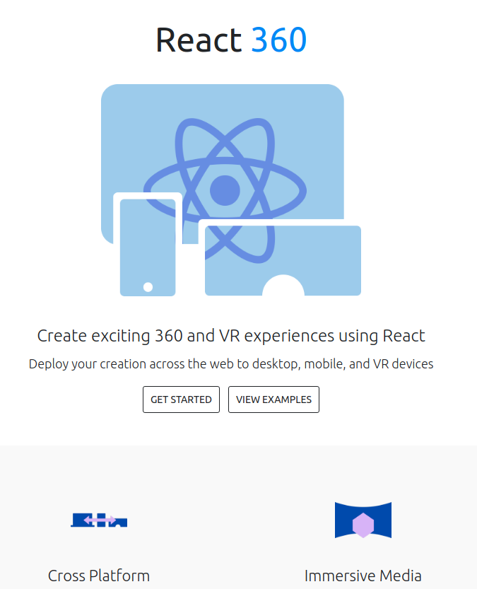

<div style="background-color:#FFFFCC">


</div>
# Cruising into Web Development
### in 2018
--------
#### Aug 28th 2018

---

## About Ben <!-- .element class="fragment title" -->
<div class="fragment img-circle" />


GT | Georgia Tech Research Institute  | Cypress.io 
-|-|-|
2015|2016|2018 - present

---

# Why web dev 🤔 <!-- .element: class="fragment dim title" -->

## Development is fast ⚡ <!-- .element: class="fragment grow dim " -->
## Webapps are king 👑 <!-- .element: class="fragment grow dim " -->
## Big Companies invest 💰  <!-- .element: class="fragment grow dim" -->
## JavaScript all the things 🙌 <!-- .element: class="fragment grow dim" -->

notes:
Idea to app
- fast for resume builders
- fast for startups
- fast for iteration

Easy to share
- most cross platform
 - portfolio site easy to view
- designs are easy to view
- free hosting is everywhere

JavaScript JavaScript JavaScript
- not going away
- is applicable on client, server, or simple terminal apps
- fastest growing language on github
- largest amount of user contributed modules

Big Names
- Facebook, Google, Microsoft invest heavily in Open Source
- Most of that investment is in JS
- Take advantage of the work already done

---

# PWAs - Progressive Web apps 🔥 <!-- .element: class="fragment dim title" -->

<div class="fragment up">
[https://pwa.rocks](https://pwa.rocks/) 

</div>

notes:

define PWA
trends towards - instant apps
tiny in size
faster to download for users
Google has some good talks


---V

### [PWA - flappy bird](https://www.progressivewebflap.com/)
<!-- .element: class="fragment" -->

<!-- .element: class="fragment" -->

---V


### [PWA - polytimer.rocks](https://polytimer.rocks/)
<!-- .element: class="fragment" -->

<!-- .element: class="fragment" -->

---V

### [PWA - Paper Planes](https://paperplanes.world/)
<!-- .element: class="fragment" -->

<!-- .element: class="fragment" -->

---

# Virtual Reality 😎 <!-- .element: class="fragment dim title" -->

<div class="fragment up">
### VR in the webbrowser!
[facebook.github.io/react-360/](https://facebook.github.io/react-360/) 
 

---

# WebGL 💎 <!-- .element: class="fragment dim title" -->
<div class="fragment up">
[not sure what this is, but it sure looks cool](https://surface-floater.lusion.co)
[](https://surface-floater.lusion.co)

---

# Native Desktop Apps (Electron) <!-- .element: class="fragment dim title" -->
<div class="fragment up img-clear">

</div>
<div class="fragment up img-clear">
  


---


---

## That's a lot of stuff 😲
### (You just gotta start with the basics) <!-- .element class="fragment" -->

## HTML / CSS <!-- .element class="fragment" -->

---

# HTML / CSS

- easy to learn
- building blocks of the web
- determines layout + style

HTML
```html
<!-- comment -->
<div class="foobar">
    <input type="text">
</div>
```

CSS
```css
.foobar {
    opacity: .5;
}

input {
    background-color: red;
}
```

---V

<div class="full-page">


---V

## For beginners:

Traversy Media 👌

https://www.youtube.com/user/TechGuyWeb/


---V

## For those with Experience:

✔️

---

# JavaScript

- Scripting lanuage of the web
- Turns sites into apps
- Multiple versions of it (ES2015+)

<br>

#### hello world - keeping it 💯
<div class="small-code"/>
```js
console.log('Hello world')
```

---V

## For beginners:

Traversy Media 👌

### [Basic JavaScript Tutorials](https://www.youtube.com/watch?v=vEROU2XtPR8&list=PLillGF-RfqbbnEGy3ROiLWk7JMCuSyQtX)


---V

## For those with Experience:

### Learn about JS ES2015+

- `async` / `await`
- arrow functions`
- `let` / `const` 


---V

## JavaScript ES2015+

```js
const names = ['jim', 'jake', 'sally']
const printNames = () => {
    for (name of names) {
        console.log(name)
    }
}
printNames(names)
```

---

## Front-end Frameworks

<div class="fragment">
- abstractions around HTML/CSS/JS
- make JS more scalable
- reusable components

<div class="fragment">
<br>
### examples:
<div class="img-clear">
#### React  Vue  Angular 

---V

<div class="img-clear">
## React 

- developed at facebook
- popular at start-ups
- trendy
- JSX

---V

#### React Components

```js
import Component from './Component'

export default {
    constructor() {
        this.state = {name:'foo'}
    }
    render () {
        return (
            <div> {name}
                <Component/>
                <Component/>
                <Component/>
            </div>
        )
    }
}
```


---V

<div class="img-clear">
## Vue 

- Easy, light weight
- .vue single file components
- Recently surpassed React on Github 🌟

---V

#### Vue Components

```html
<template>
    <div> {name}
        <label>
        <input>
        <Component>
</template>
<script>
    import Component from './Component'
    export default {
        data: {
            name: 'foo'
        }
    }
</script>
<style>input {background-color:red}</style>
```

---V

<br><br>
<div class="fragment up">

<div class="img-clear">
## Angular 
<br>
<div class="fragment up">
# 🤮
<br>
<br>
<div class="fragment up">

- Not even used by Google
- popular in big enterprise
- popular to hate on

---

# Native Mobile Apps
## One language to rule them all

- JS 👉 Swift, Java

<div class="img-clear big">


---V

## what in the world...


New logos are created every hour

---

# More JavaScript <!-- .element class="fragment title"-->

<div class="fragment">
## JavaScript outside the browser with **`Nodejs`**

---V

<div class="img-clear">

# NodeJS 

- Runs outside the browser
- access to file system
- Classified as a Server Side Language


---V

<br>
<div class="fragment up img-logo">


---V

# **`npm`**
## (node package manager)


---V

## Easier way to install things
<div class="small-code">
```bash
$ npm install
```

---V

<div class="medium-code">
```js
<script crossorigin src="https://unpkg.com/react-dom@16/umd/react-dom.development.js"></script>
```
vs.

```js
import React from 'react'
```


---V

## Adding Animations to Terminal
[](https://github.com/bokub/chalk-animation)
<br>
 
   
  
   
    


---

# WebDev Tooling <!-- .element class="fragment title"-->
### (the stuff you should learn and use) <!-- .element class="fragment"-->

---V

<br>
<div class="fragment up">
## Git
```sh
$ git add .
$ git commit -m 'fix this stuff'
$ git push origin HEAD
```
<div class="fragment">
## Basic Terminal Commands
```sh
$ mkdir myfolder
$ cd myfolder
$ cp ~/thisFolder ~/thatFolder
```
<div class="fragment">
## Search Engine
- duckduckgo (instant SO answers)

<div class="fragment">
<div class="fragment">


---V

IDE / Text Editor: **[`VSCode`](https://code.visualstudio.com/)**


---

# Now its your turn.

---V

## Deploy Your own site!

<div style="display:inline-block">
 <!-- .element style="max-width:40%; vertical-align:top;margin-right:1em;" -->
 <!-- .element style="max-width:40%; vertical-align:top" -->

</div>

---V

### Your own site in 3 clicks
### [github.com/gt-webdev/html-css-only](https://www.github.com/gt-webdev/html-css-only)
#### (follow the readme)

